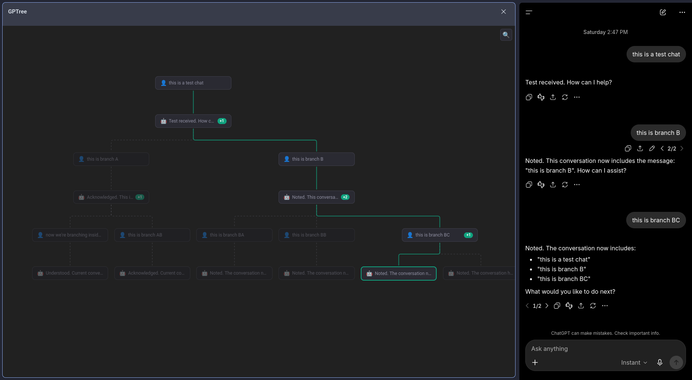

# GPTree — ChatGPT Conversation Tree Viewer

A Firefox browser extension that visualizes your ChatGPT conversations as interactive tree graphs, letting you navigate branching conversations visually.

## How It Works

GPTree adds a sidebar panel to ChatGPT that renders the hidden conversation mapping as an interactive node graph. Every time ChatGPT branches (regenerating answers, editing prompts), those branches become visible as alternate paths you can click to revisit.

- **ChatGPT → Graph**: Navigating branches in ChatGPT instantly updates the graph highlight
- **Graph → ChatGPT**: Click any node in the graph to switch ChatGPT to that branch
- **Search & Hover**: Find messages by content or preview them by hovering

## Screenshot



## Installation

### From Source

```bash
git clone https://github.com/corbin-c/gptree.git
cd gptree
npm install
npm run build
```

Then load in Firefox:

1. Navigate to `about:debugging`
2. Click **This Firefox** → **Load Temporary Add-on**
3. Select `build/firefox-mv3-dev/manifest.json`

The sidebar icon will appear in your toolbar. Open any ChatGPT conversation page, then click the icon to toggle the tree view.

### Requirements

- Firefox 128+
- Works on `https://chatgpt.com/c/*` and `https://chatgpt.com/g/*/c/*` URLs

## Features

| Feature                   | Description                                                                                |
| ------------------------- | ------------------------------------------------------------------------------------------ |
| **Tree Visualization**    | Full branching structure rendered top-down with dagre layout                               |
| **Two-Way Binding**       | Navigate in ChatGPT → graph updates. Click nodes → ChatGPT switches branches               |
| **Active Path Highlight** | Blue borders trace the currently visible conversation lineage                              |
| **Search with Auto-Zoom** | Toggle search (🔍), type to highlight matching nodes in yellow, viewport auto-fits results |
| **Hover Preview Panel**   | Hover any node to see its full message content at the bottom of the sidebar                |
| **Branch Navigation**     | Click idle (non-active-path) nodes to switch ChatGPT to that branch                        |
| **TOC Fallback**          | Large conversations with virtualized turns work via ChatGPT's table of contents            |
| **Role Filtering**        | System and tool messages are hidden from the graph but edges are preserved                 |

## Architecture

GPTree uses [Plasmo](https://www.plasmo.com/) (a browser extension framework) with React 18, ReactFlow, and dagre running in TypeScript.

### Content Scripts

Two content scripts run on ChatGPT pages:

- **`src/contents/chatgpt.ts`** — MAIN world. Intercepts the conversation API, polls the DOM for branch changes, and drives branch switching by clicking ChatGPT's Previous/Next response buttons or using the table of contents fallback.
- **`src/contents/isolated-bridge.ts`** — ISOLATED world. Bridges `window.postMessage` (main world) and `browser.runtime` (extension world) across the security boundary.

### Sidebar UI

Rendered in Firefox's sidebar panel:

- **`src/tabs/tree.tsx`** — Sidebar root. Manages state, search, hover preview, and node click routing.
- **`src/components/TreeView.tsx`** — ReactFlow renderer with auto-zoom and edge styling.
- **`src/components/TreeNode.tsx`** — Single node with role badge, preview text, branch count, and contextual highlights.

### Data Layer

- **`src/lib/tree-model.ts`** — Parses ChatGPT's raw API response into a `ConversationTree` with nodes, parent/child relationships, and active path computation.
- **`src/lib/tree-layout.ts`** — Computes dagre positions, filters hidden roles, and re-wires edges to skip invisible nodes.
- **`src/lib/interceptor.ts`** — Monkey-patches `window.fetch` to capture conversation data.
- **`src/background.ts`** — Relays sidebar clicks to the correct ChatGPT tab.

## Development

```bash
# Install dependencies
npm install

# Development with hot reload
npm run dev

# Production build
npm run build

# Package as .zip for distribution
npm run package
```

### Project Structure

```
src/
├── background.ts                 # Extension background (tab routing, sidebar toggle)
├── contents/
│   ├── chatgpt.ts                # MAIN world: interceptor, DOM polling, navigation
│   └── isolated-bridge.ts        # ISOLATED world: cross-world message relay
├── tabs/
│   └── tree.tsx                  # Sidebar panel root component
├── components/
│   ├── TreeView.tsx              # ReactFlow graph container
│   └── TreeNode.tsx              # Individual node rendering
├── lib/
│   ├── tree-model.ts             # Conversation data model and parsing
│   ├── tree-layout.ts            # Dagre layout computation
│   ├── interceptor.ts            # fetch monkey-patch for API interception
│   └── bridge.ts                 # Cross-world message utilities
└── hooks/
    └── useConversationTree.ts    # React hook for conversation data subscription
```

## Tech Stack

- **Extension Framework**: [Plasmo](https://www.plasmo.com/) v0.90
- **Graph Rendering**: [ReactFlow](https://reactflow.dev/) (@xyflow/react v12)
- **Layout**: [dagre](https://github.com/dagrejs/dagre) v0.8
- **Runtime**: React 18, TypeScript 5.5
- **Build**: Bun + plasmo CLI
- **Target**: Firefox Manifest V3
